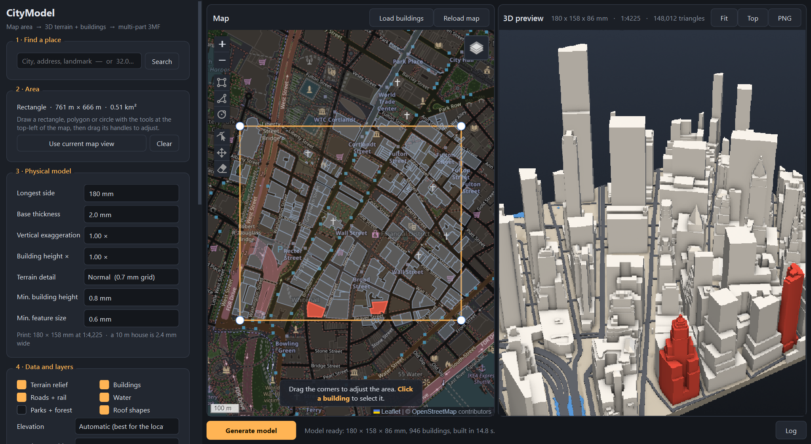

# CityModel

Pick an area on a map, get a 3D "sky view" model of it — terrain, buildings, roads, water —
and export a multi-part **3MF** (or a folder of STLs) for multi-colour 3D printing.



## Setup (Windows)

1. Install **Python 3.10 or newer** (3.12 recommended) from python.org — tick *Add python.exe to PATH*.
2. In this folder:

   ```bat
   python -m pip install -r requirements.txt
   ```

   About 600 MB, most of it Qt and VTK. Optional: `python -m pip install overturemaps`
   (adds building heights where OpenStreetMap has none; slow first download per area).
3. Run it: double-click **`run_citymodel.bat`**, or

   ```bat
   python -m citymodel
   ```

The original tkinter app is untouched in `legacy/` (`run_legacy.bat`). Its poster, AR-marker and
country-outline tools were not ported.

## Using it

1. **Find a place** — name, address, or pasted coordinates (`32.0853, 34.7818`, `40.7 N 74 W` …).
2. **Mark the area** on the map with the rectangle, polygon or circle tool (top-left of the map);
   drag the handles to adjust. *Use current map view* makes a rectangle from what you see.
3. Building outlines load by themselves for areas up to 6 km² (button: *Load buildings*).
   **Click a building** to select it — on the map or, after generating, in the 3D preview.
   Selected buildings turn red in both and become their own parts in the export.
4. **Generate model**. Left-drag orbits, wheel / right-drag zooms, Shift-drag pans.
5. **Export**. Every component is checked (watertight, manifold, outward normals), repaired if
   needed, and the 3MF is re-opened to verify it before the report is shown.

Settings persist between sessions (`%APPDATA%\CityModel\settings.json`). Downloads are cached in
`%LOCALAPPDATA%\CityModel\cache` — a repeat area loads instantly; *Appearance → Clear download
cache* empties it.

### In the slicer

The default 3MF layout is **one object with several parts**: `terrain`, `buildings`, one part
per selected building (or one `selected_buildings` part), `water`, `roads`, `green`.

* **Bambu Studio / OrcaSlicer** — open the file, expand the object in the *Objects* list, and set
  a filament per part. If asked whether to load it "as a single object with multiple parts": yes.
* **PrusaSlicer** — same: the parts appear under the object; right-click → *Change extruder*.
* **Cura** — the parts arrive as a group; ungroup or select with Ctrl-click and set *Print with*
  per part. (Cura merges overlapping volumes per extruder order; enable *Remove mesh intersection*.)

Parts overlap slightly by design (buildings reach 0.6 mm into the ground so nothing floats).
Tick **Cut building sockets into the terrain** if you would rather have exactly complementary
parts — useful when printing buildings separately and gluing them in.

## Data sources

| What | Source | Resolution | Key | Licence |
|---|---|---|---|---|
| Buildings, roads, water, green | OpenStreetMap via Overpass API (4 mirrors) | — | no | ODbL — credit "© OpenStreetMap contributors" |
| Elevation, USA | **USGS 3DEP** image service | 1 m where lidar exists, else 10 m; bare earth | no | public domain |
| Elevation, UK / Austria / Norway / NZ | **AWS Terrain Tiles** (Mapzen) — national lidar models | 2–10 m, bare earth | no | open data, attribution |
| Elevation, everywhere else | **Copernicus GLO-30** (public AWS bucket) | 30 m, surface model | no | free, attribution required |
| Elevation, fallback | AWS Terrain Tiles (SRTM) | 30 m, surface model | no | open data, attribution |
| Elevation, optional | OpenTopography (COP30 …) | 30 m | **free key** | per dataset |
| Building heights, optional | Overture Maps (conflates OSM + Microsoft + Google + Esri) | — | no | ODbL / CDLA-Permissive |
| Place search | Nominatim | — | no | ODbL; 1 request/s, results cached |

"Automatic" picks the finest bare-earth source that covers the area, then Copernicus, then the
AWS tiles. Why Copernicus before SRTM: it is newer (2011–15 vs 2000), has fewer voids and no
integer-metre terracing. Both are *surface* models — they include roofs — so under building
footprints the terrain is replaced by its lower envelope (*Flatten radar bumps*); bare-earth
sources are left alone. Google Open Buildings heights were evaluated and left out: they are only
distributed through Earth Engine, which needs an account.

**Building height when OSM has none** (in order): `height` tag → `building:levels` × 3 m →
Overture height / floors → an estimate: a typical height for the `building=*` type, pulled
toward the median measured height within 180 m (small sheds and garages stay small).

**Projection**: a transverse Mercator centred on the area (UTM's maths without UTM's zone
offset) — scale error below 1 ppm across a city, and north stays straight up instead of
rotating by up to 3° near a zone edge. The DEM is sampled bicubically at the model grid nodes,
so there are no tile seams or nearest-neighbour steps.

## Code map

```
citymodel/
  data/      cache.py http.py overpass.py osm_parse.py elevation.py overture.py geocode.py
  geo/       projection.py frame.py dem.py
  mesh/      primitives.py terrain.py surface.py buildings.py heights.py roofs.py layers.py validate.py
  export/    threemf.py stl.py
  render/    scene.py            PyVista scene (also used for offscreen snapshots)
  ui/        app.py main_window.py sidebar.py map_widget.py preview_widget.py workers.py theme.py
  pipeline.py model.py settings.py
tests/       offline tests (synthetic OSM + analytic hill): python -m pytest
tools/       e2e.py (live end-to-end on real locations)  ui_selftest.py (drives the real app)
legacy/      the original application, unchanged
```

Headless use:

```python
from citymodel import pipeline
from citymodel.settings import Area, ModelSettings

area, s = Area(bbox=(40.748, -73.992, 40.758, -73.979)), ModelSettings(size_mm=180)
model = pipeline.build_model(area, s, pipeline.fetch_data(area, s))
pipeline.export_model(model, selected_ids=["way/34633854"], settings=s, out_dir="out", name="midtown")
```

## Known limitations

* Building-level data is limited to 60 km² per model (Overpass would time out); larger areas
  work as terrain-only models.
* OSM height coverage varies a lot — Manhattan is ~95 % tagged, many cities under 10 %.
  Estimated heights are plausible, not measured.
* 30 m elevation cannot show small landforms; outside the USA and the four lidar countries that
  is the best free global data.
* Sea is detected from elevation ≤ 0 m, so land below sea level in a coastal model could be
  painted as water (disable *Water* or the sea clamp is skipped when the area's median is below 0).
* The map needs internet for its tiles and for Leaflet itself (loaded from jsDelivr).
* Bridges and tunnels are drawn on the ground; `building:part` tiers with `min_height` are the
  only floating geometry (they rest on the parts below them).
